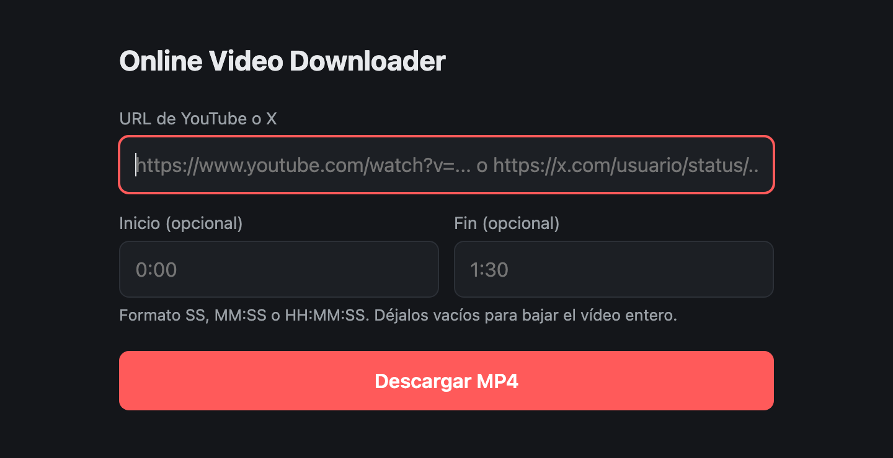

# Online Video Downloader

Descargador local de vídeos de YouTube y X (Twitter) a MP4, con recorte opcional por tiempo. Se usa desde el navegador y los ficheros se guardan en `downloads/` (no se borran).



## Uso

1. Arranca la app (con [Docker](#opción-a-docker-recomendada) o [a mano](#opción-b-arranque-manual)).
2. Abre <http://127.0.0.1:8000>.
3. Pega la URL de un vídeo de YouTube o de X y pulsa **Descargar MP4**.

Los campos de inicio y fin son opcionales (formatos `SS`, `MM:SS` o `HH:MM:SS`). Si los dejas vacíos se descarga el vídeo entero. El MP4 queda en `downloads/` y también se sirve en `/files/<nombre>`.

> **Seguridad:** la app no tiene login. Está pensada para uso local, por eso Docker publica el puerto solo en `127.0.0.1`. No la expongas a internet ni a tu red sin ponerle autenticación delante.

## Opción A: Docker (recomendada)

No necesitas instalar Python ni ffmpeg, solo Docker Desktop en marcha.

```bash
docker compose up -d --build
```

Abre <http://127.0.0.1:8000>. Los MP4 se guardan en tu carpeta `downloads/` y no se pierden al borrar el contenedor.

```bash
docker compose logs -f     # ver logs
docker compose stop        # apagar
docker compose start       # volver a encenderlo
docker compose down        # apagar y eliminar el contenedor
```

La configuración está en [compose.yaml](compose.yaml). El contenedor se reinicia solo con Docker Desktop (`restart: unless-stopped`); `docker compose down` lo quita para que no vuelva a arrancar.

### Reconstruir (cambios de código o actualizar yt-dlp)

`docker compose start` reutiliza la imagen ya construida. Si cambias el código, o si YouTube o X empiezan a fallar (casi siempre basta con actualizar yt-dlp), reconstruye sin caché para que baje la última versión:

```bash
docker compose build --no-cache
docker compose up -d
```

## Opción B: arranque manual

### Requisitos

- Python 3.10 o superior (probado con 3.12)
- [ffmpeg](https://ffmpeg.org/) en el PATH (`brew install ffmpeg` en macOS): une audio y vídeo y recorta

### Instalación

```bash
python3.12 -m venv venv
source venv/bin/activate
python -m pip install -r requirements.txt
```

El venv aísla las librerías del proyecto del Python global. Usa `python -m pip` en lugar de `pip`: funciona igual dentro y fuera del venv (macOS no trae un comando `pip` suelto).

### Arrancar

```bash
source venv/bin/activate
uvicorn main:app --reload
```

Uvicorn escucha por defecto solo en `127.0.0.1`.

### Apagar

- En la terminal donde corre, pulsa `Ctrl+C`.
- Para salir del entorno virtual: `deactivate`.

Si el servidor sigue vivo sin que lo veas (por ejemplo, error `Address already in use`), búscalo por el puerto y mátalo:

```bash
lsof -nP -iTCP:8000 -sTCP:LISTEN   # muestra el PID
kill <PID>                         # cierre normal
kill -9 <PID>                      # solo si no responde al anterior
```

En una sola línea:

```bash
kill $(lsof -tiTCP:8000 -sTCP:LISTEN)
```

Con `--reload`, uvicorn lanza un proceso vigilante y otro hijo que sirve la app. Si queda alguno colgado:

```bash
pkill -f "uvicorn main:app"
```

### Actualizar yt-dlp

```bash
source venv/bin/activate
python -m pip install -U yt-dlp
```

## Cómo está hecho

- **Backend** ([main.py](main.py)): FastAPI + [yt-dlp](https://github.com/yt-dlp/yt-dlp).
  - `POST /api/download` valida la URL (solo dominios de YouTube y X/Twitter, lista `ALLOWED_HOSTS`) y los tiempos, y lanza la descarga en un pool de 2 hilos.
  - `GET /api/download/{id}` devuelve el estado y el progreso del trabajo, que el frontend consulta periódicamente.
  - `/files/<nombre>` sirve los MP4 descargados.
- **Frontend** ([static/index.html](static/index.html)): una sola página en HTML y JavaScript, sin dependencias.
- **Docker** ([Dockerfile](Dockerfile), [compose.yaml](compose.yaml)): imagen `python:3.12-slim` con ffmpeg y las dependencias de [requirements.txt](requirements.txt).
- **Dependencias**: FastAPI y uvicorn están fijados a una versión menor para evitar roturas. yt-dlp va sin fijar a propósito, porque necesita estar siempre al día.
- **Formato**: mejor calidad MP4 hasta 1080p, con alternativas si no existe.
- **Recortes**: se cortan en el keyframe más cercano para ser rápidos, así que pueden desplazarse uno o dos segundos. Si necesitas precisión exacta, añade `opts["force_keyframes_at_cuts"] = True` en `run_job`; recodifica el clip y es mucho más lento.
- El estado de los trabajos vive en memoria, así que se pierde al reiniciar el servidor.

## Problemas habituales

- **`The page needs to be reloaded` u otros errores de YouTube o X**: yt-dlp está desactualizado. Actualízalo (ver [Docker](#reconstruir-cambios-de-código-o-actualizar-yt-dlp) o [arranque manual](#actualizar-yt-dlp)). Las versiones recientes exigen Python 3.10 o superior; con 3.9 pip se queda en una versión antigua.
- **`Address already in use`**: ya hay algo en el puerto 8000, otro servidor o un contenedor. Ciérralo, o usa otro puerto: `--port 8001` en uvicorn, o cambia `"127.0.0.1:8000:8000"` por `"127.0.0.1:8001:8000"` en `compose.yaml`.
- **Tuits sin vídeo, privados o de cuentas protegidas**: dan error, porque la app no gestiona inicio de sesión.
- **Enlaces `t.co`**: no se admiten; pega la URL directa del tuit.

## Aviso legal

Úsalo solo con contenido que tengas derecho a descargar y respeta los términos de servicio de YouTube y X. El autor no se hace responsable del uso que se haga de la herramienta.

## Licencia

[MIT](LICENSE)
